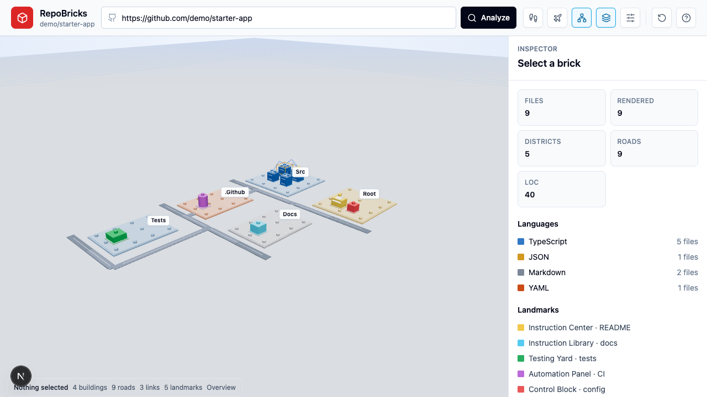
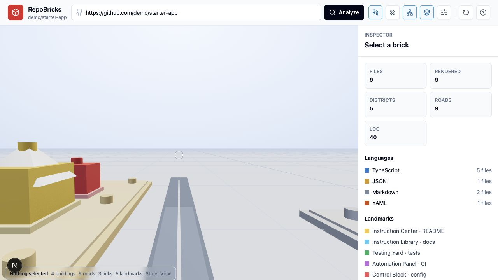
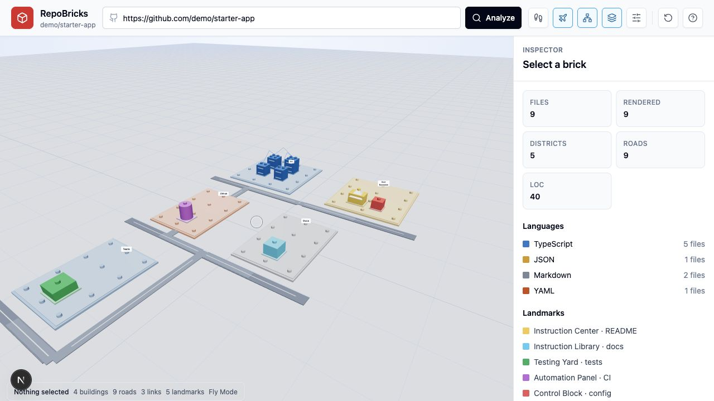

# RepoBricks

RepoBricks turns a public GitHub repository into an explorable brick-style 3D architecture map.

Paste a repo URL, analyze its tracked files, and walk, fly, or orbit through a generated model where folders become baseplates, files become buildings, imports become links, and important project files become landmarks.



## Highlights

- Public GitHub repo intake through `POST /api/analyze`
- Deterministic repo-to-world manifest for repeatable layouts
- Brick-style districts, file buildings, roads, landmarks, studs, and dependency links
- Language colors, role-specific roofs, TODO scaffolds, symbol stacks, dependency pulses, and inspector details
- Overview orbit mode, street-level walking mode, and free-flight mode
- Local fixture tests so CI can run without GitHub network access

## Screenshots

### Street View

Walk road-level through the generated repo city and inspect buildings up close.



### Fly Mode

Fly above the model, climb to any height, and inspect the architecture from custom angles.



## Controls

Overview mode:

- Drag: orbit
- Right drag: pan
- Scroll: zoom
- Click a brick: select and focus
- Reset button: return to overview framing

Street view:

- `W A S D`: walk
- Mouse drag: look around
- `Q` / `E` or arrow keys: turn
- `Shift`: move faster
- Scroll or `+` / `-`: dolly forward/back

Fly mode:

- `W A S D`: fly forward/back/strafe
- `Space` or `R`: climb
- `F` or `C`: descend
- Mouse drag: look around
- Arrow keys or `Q` / `E`: adjust view
- `Shift`: boost
- Scroll or `+` / `-`: dolly along view direction

## Quick Start

```bash
npm install
npm run dev
```

Open <http://localhost:3000>.

For a deterministic offline demo, open:

```text
http://localhost:3000/?demo=1
```

## Scripts

```bash
npm run dev       # Start the Next.js app
npm run build     # Production build and type check
npm run lint      # ESLint with zero warnings
npm run test      # Vitest unit tests
npm run test:e2e  # Playwright browser tests
```

## How It Works

1. The API validates `https://github.com/owner/repo` URLs.
2. The analyzer clones the public repo with a shallow Git clone.
3. Tracked files are grouped into districts by top-level folder.
4. File metrics are extracted: bytes, LOC, imports, symbols, TODO/FIXME count, and language.
5. Simple local imports are resolved into dependency connections.
6. Landmark files such as READMEs, docs, tests, workflow files, and config files get special shapes.
7. The frontend renders the versioned `WorldManifest` with React Three Fiber.

## Architecture

- Next.js App Router for the web app and API route
- TypeScript across frontend, backend, and tests
- React Three Fiber, Drei, and Three.js for the 3D renderer
- Zustand for scene state, selection, toggles, and camera modes
- Vitest for analyzer/API behavior
- Playwright for browser and canvas smoke tests

## Current Limits

- Public GitHub repositories only
- Node runtime required because repo analysis uses Git and temp files
- Repos over 20,000 tracked files are rejected
- At most 1,500 files are rendered in the MVP
- Files over 250 KB are represented but not scanned for imports or symbols
- Generated/vendor folders are skipped
- Private repos, persistence, sharing, AI summaries, and commit-history playback are future work

## API

```http
POST /api/analyze
Content-Type: application/json

{
  "repoUrl": "https://github.com/owner/repo"
}
```

Returns a versioned `WorldManifest`:

```ts
{
  version: "1.0",
  repo: RepoInfo,
  stats: WorldStats,
  districts: District[],
  buildings: Building[],
  connections: Connection[],
  roads: Road[],
  landmarks: Landmark[],
  warnings: string[]
}
```

## Project Direction

RepoBricks is built for semantic code comprehension, not just spectacle. The goal is to make a repository feel spatial: source folders become neighborhoods, important files become landmarks, and imports become visible paths between code structures.

This project uses a generic brick-building metaphor and is not affiliated with any toy brand.
